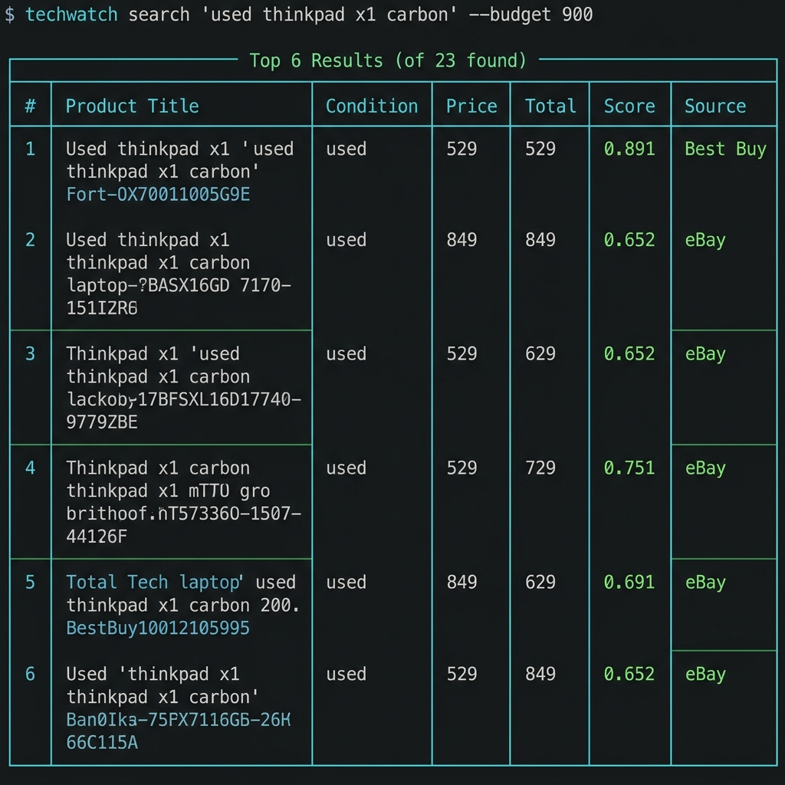
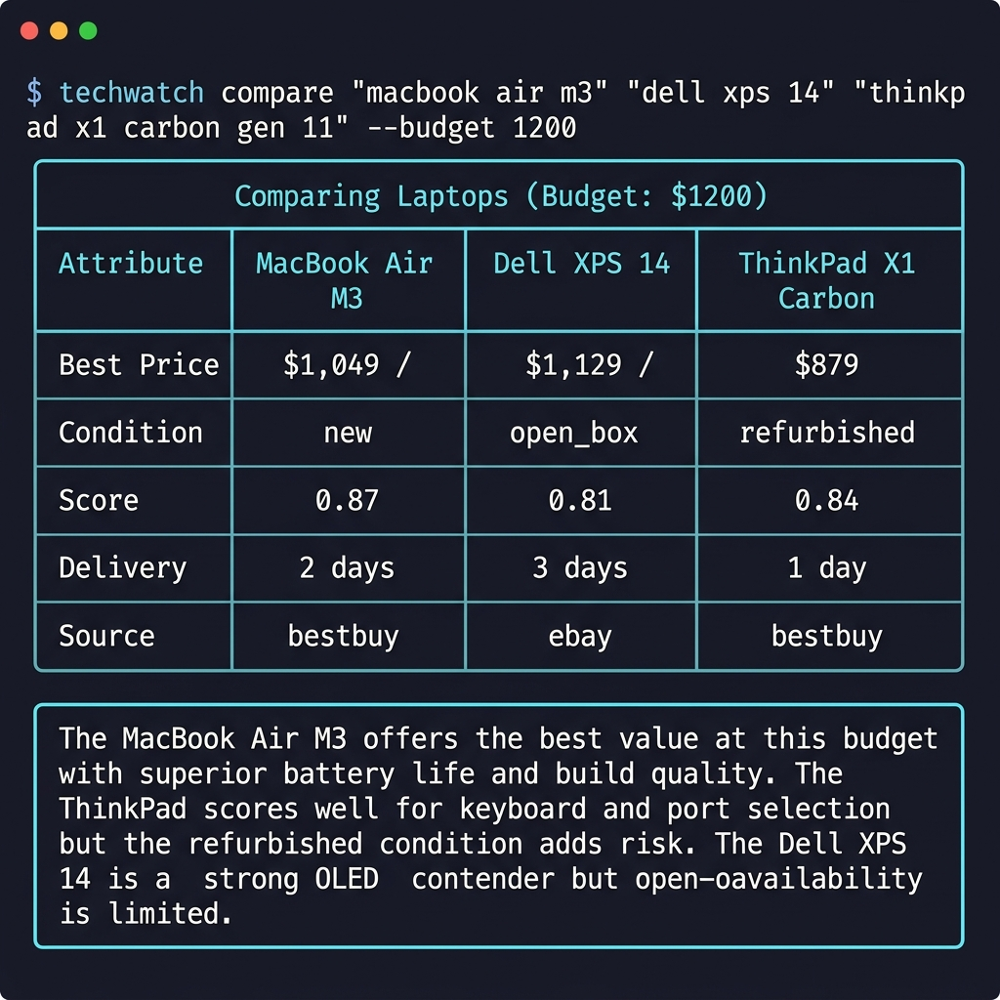
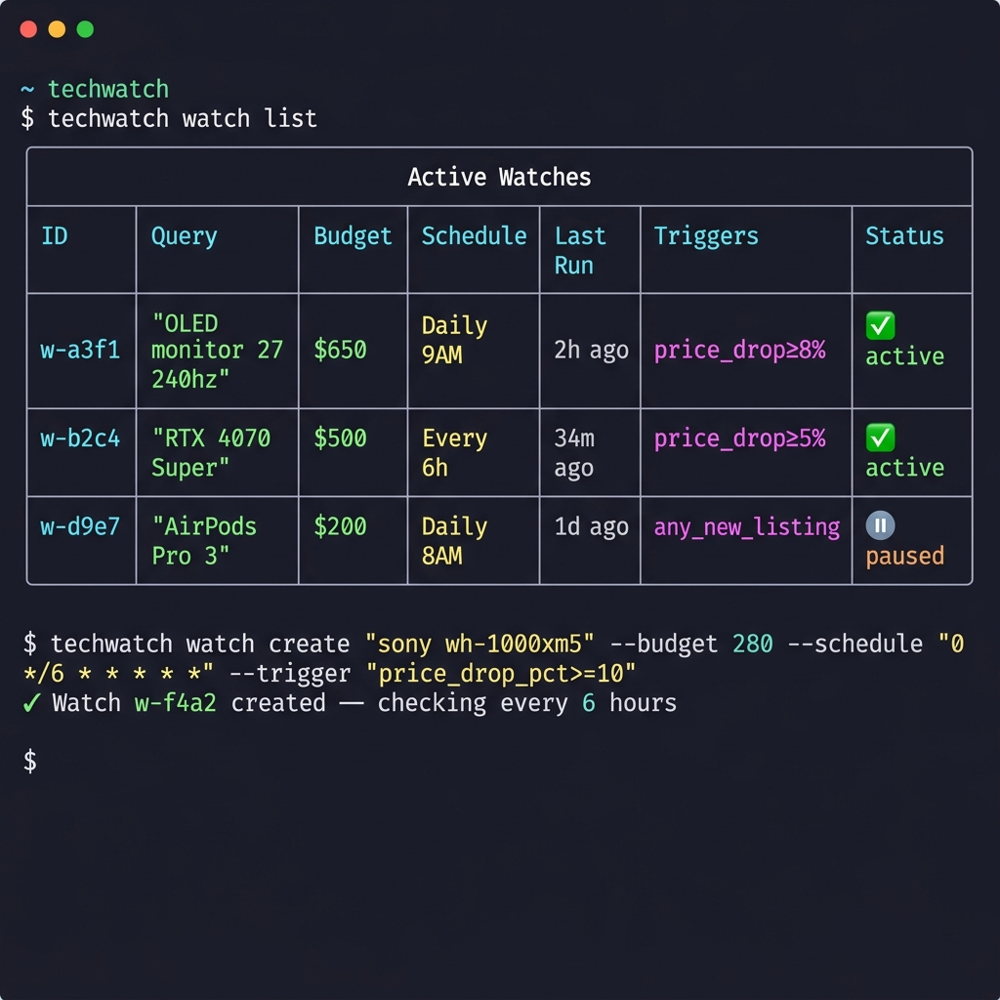
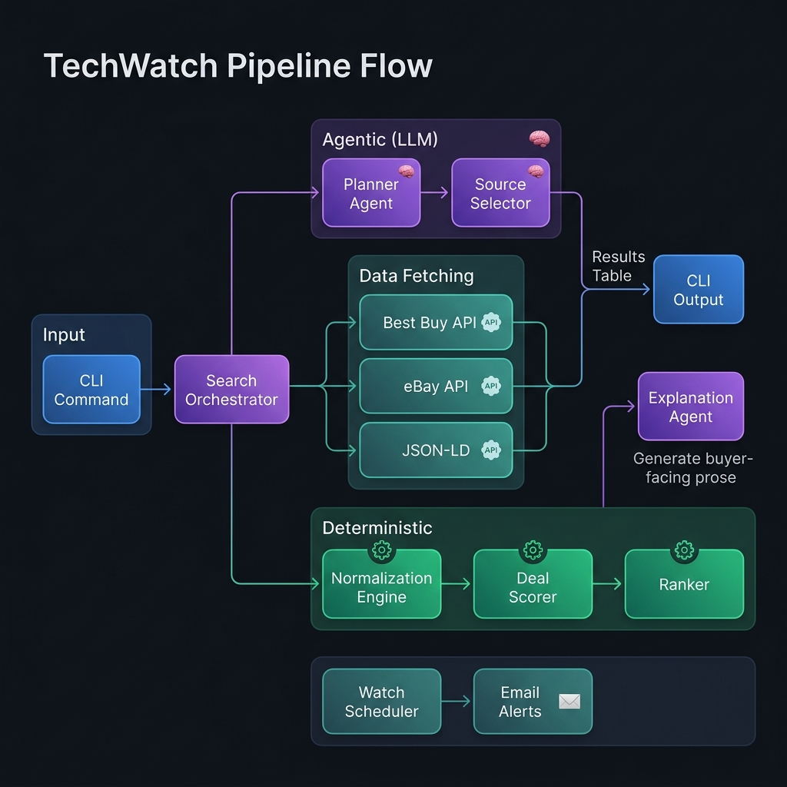

<p align="center">
  <h1 align="center">TechWatch</h1>
  <p align="center">
    <strong>Agentic deal-intelligence platform for consumer electronics</strong>
    <br />
    LLM-powered search, comparison, and price tracking across Best Buy, eBay, and structured web data.
  </p>
  <p align="center">
    <a href="#quick-start">Quick Start</a> •
    <a href="#features">Features</a> •
    <a href="#architecture">Architecture</a> •
    <a href="#cli-reference">CLI Reference</a> •
    <a href="#development">Development</a>
  </p>
</p>

---

## The Problem

Buying tech is tedious. You're juggling tabs across Best Buy, eBay, and Amazon — comparing prices, decoding condition labels like "Excellent - Certified" vs "Seller Refurbished," and hoping you haven't missed a better deal. If you wait, prices change and stock disappears.

**TechWatch automates the entire research workflow.** It uses AI agents for what they're good at — understanding your intent and writing explanations — while keeping scoring, ranking, and price comparison **deterministic and auditable**.

## Features

### 🔍 Intent-Driven Search

Describe what you want in natural language. The planner agent converts your query into a structured search plan across multiple marketplaces simultaneously.

<p align="center">
  
</p>

### ⚖️ Side-by-Side Comparison

Compare products across sources with a unified scoring model. The explanation agent generates buyer-facing prose grounded in real data — not hallucinated specs.

<p align="center">
  
</p>

### 👁️ Price Watches & Email Alerts

Set up automated watches with cron schedules and trigger conditions. Get email digests when prices drop, new listings appear, or market conditions shift.

<p align="center">
  
</p>

---

## Why Agentic?

Tech purchasing involves ambiguous tradeoffs, inconsistent condition labels, changing schemas, and context-sensitive decisions. TechWatch separates concerns cleanly:

| Deterministic *(no LLM)* | Agentic *(LLM-powered)* |
|:--|:--|
| Condition normalization | Intent → search plan |
| Price + delivery scoring | Buyer-facing explanations |
| Multi-axis ranking formula | Deal narrative generation |
| Currency conversion (ECB rates) | Watch trigger summaries |

> **Invariant:** LLMs may plan and explain, but they never mutate normalized facts. All scoring is deterministic and inspectable.

---

## Architecture

<p align="center">
  
</p>

```
CLI → Orchestrator
  → Planner Agent (LLM)         →  Natural language → structured search plan
  → Source Selector              →  Choose adapters based on plan
  → Adapter Layer                →  Fetch raw data (Best Buy, eBay, JSON-LD)
  → Normalization Engine         →  Deterministic canonical mapping
  → Deal Scorer                  →  Weighted ranking (spec, cost, delivery, condition, trust)
  → Explanation Agent (LLM)      →  Generate buyer-facing prose
  → Persistence Layer            →  SQLite: price history, watch state
  → Scheduler + Email            →  Background monitoring + SMTP digests
```

### Deterministic Ranking

Every offer gets a composite score from five weighted dimensions:

| Component | Weight | Signal |
|:--|:--|:--|
| **Spec Fit** | 35% | How well the item matches your requirements |
| **Total Landed Cost** | 30% | Price + shipping + fees vs. budget |
| **Delivery** | 15% | Speed, reliability, pickup availability |
| **Condition Confidence** | 10% | 3-axis condition assessment quality |
| **Seller/Source Trust** | 10% | Marketplace reputation + seller history |

### 3-Axis Condition Model

Marketplaces describe condition differently. TechWatch normalizes every listing into three independent axes:

| Axis | Values | Purpose |
|:--|:--|:--|
| **Canonical Condition** | `new`, `open_box`, `certified_refurbished`, `used_good`, `used_fair`, `for_parts` | Universal classification |
| **Functional State** | `fully_functional`, `minor_issues`, `for_parts`, `unknown` | Does it work? |
| **Cosmetic Grade** | `pristine`, `excellent`, `good`, `fair`, `poor`, `unknown` | How does it look? |

---

## Source Support

| Source | Type | Capabilities |
|:--|:--|:--|
| **Best Buy Products API** | Official API | Full catalog search, specs, pricing |
| **Best Buy Open Box API** | Official API | Discounted open-box inventory |
| **eBay Browse API** | Official API | Marketplace listings, filters, facets |
| **eBay Taxonomy API** | Official API | Category resolution, condition policies |
| **JSON-LD Extractor** | Structured web | Schema.org Product/Offer from any page |
| **ECB Exchange Rates** | Reference data | Lossless currency conversion |

> All HTTP fetches go through a **domain allowlist** enforced in the adapter base class. Per-source rate limiting (`max_qps`, `burst`, `cache_ttl`) is built in.

---

## Quick Start

### Prerequisites

- Python 3.11+
- An [OpenAI API key](https://platform.openai.com/api-keys) (for the planning + explanation agents)
- A [Best Buy API key](https://developer.bestbuy.com/) (for product data)

### Install

```bash
# Clone
git clone https://github.com/EricLevesque01/techwatch.git
cd techwatch

# Create virtual environment
python -m venv .venv
.venv\Scripts\activate        # Windows
# source .venv/bin/activate   # macOS / Linux

# Install with dev dependencies
pip install -e ".[dev]"
```

### Configure

```bash
cp .env.example .env
# Fill in your API keys:
#   OPENAI_API_KEY=sk-...
#   BESTBUY_API_KEY=...
```

### Search

```bash
techwatch search "used thinkpad x1 carbon" --budget 900 --conditions used,refurbished
```

> **No API keys?** TechWatch includes a mock adapter mode for demo/testing. Set `TECHWATCH_USE_MOCKS=true` in your `.env` to see sample results without live API calls.

---

## CLI Reference

```bash
# ── Search ─────────────────────────────────────────────────────
techwatch search "QUERY" [OPTIONS]
    --budget, -b FLOAT         Maximum budget
    --country, -c TEXT         Country code (default: US)
    --postal-code, -p TEXT     ZIP for delivery estimates
    --currency TEXT            Display currency (default: USD)
    --conditions TEXT          Comma-separated: new,open_box,refurbished,used_good,used_fair
    --top, -n INT              Number of results (default: 10)

# ── Compare & Explain ──────────────────────────────────────────
techwatch compare OFFER_ID_1 OFFER_ID_2
techwatch explain OFFER_ID

# ── Watch Management ──────────────────────────────────────────
techwatch watch create "QUERY" \
    --budget 650 --schedule "0 9 * * *" \
    --email you@example.com \
    --trigger "price_drop_pct>=8"
techwatch watch list
techwatch watch pause WATCH_ID
techwatch watch resume WATCH_ID
techwatch watch delete WATCH_ID

# ── Execution ─────────────────────────────────────────────────
techwatch run once WATCH_ID     # Execute a single watch immediately
techwatch run daemon            # Start background scheduler

# ── Utilities ─────────────────────────────────────────────────
techwatch source test bestbuy   # Verify API connectivity
techwatch source test ebay
techwatch email test            # Send test digest
techwatch export WATCH_ID --format csv
```

---

## Project Structure

```
src/techwatch/
├── cli/              # Typer commands: search, compare, explain, watch, export
├── agents/           # LLM-powered planning & explanation (OpenAI tool calling)
│   ├── planner.py        # Intent → structured search plan
│   ├── deal_analyst.py   # Threshold analysis + narrative
│   ├── explainer.py      # Buyer-facing prose generation
│   ├── orchestrator.py   # Pipeline coordinator
│   └── source_selector.py
├── adapters/         # Source data fetchers (fetch only, no normalization)
│   ├── bestbuy/          # Products, Categories, Open Box
│   ├── ebay/             # Browse, Taxonomy, OAuth2
│   ├── fx/               # ECB exchange rates
│   ├── structured/       # JSON-LD extractor
│   └── mock/             # Demo/test fixtures
├── normalization/    # Deterministic condition, title, and currency mapping
├── scoring/          # Deterministic multi-dimensional ranking
├── taxonomy/         # Category resolution across marketplaces
├── persistence/      # SQLAlchemy models, repositories, price history
├── scheduling/       # APScheduler-based watch execution
├── email/            # SMTP transport + Jinja2 digest rendering
├── evals/            # Corpus-based accuracy benchmarking
├── models/           # Pydantic domain models (Product, Offer, Watch, etc.)
└── config/           # pydantic-settings (.env driven)

tests/
├── unit/             # Models, normalization, scoring, taxonomy, adapters
├── integration/      # CLI smoke tests, persistence round-trips
├── contracts/        # Pydantic schema validation for LLM outputs
├── golden/           # Scoring regression fixtures, digest format
└── browser/          # Playwright-based adapter tests (nightly CI)
```

---

## Tech Stack

| Layer | Technology | Why |
|:--|:--|:--|
| CLI | [Typer](https://typer.tiangolo.com) + [Rich](https://github.com/Textualize/rich) | Type-safe commands, beautiful output |
| LLM | [OpenAI](https://platform.openai.com) | Tool calling + structured outputs |
| HTTP | [HTTPX](https://www.python-httpx.org) | Sync/async, timeouts, retries |
| Persistence | [SQLAlchemy](https://www.sqlalchemy.org) | ORM, migrations, transaction boundaries |
| Scheduling | [APScheduler](https://apscheduler.readthedocs.io) | Persistent cron + interval triggers |
| Validation | [Pydantic](https://docs.pydantic.dev) | Strict schema enforcement everywhere |
| Config | [pydantic-settings](https://docs.pydantic.dev/latest/concepts/pydantic_settings/) | `.env` driven, type-safe settings |
| Lint/Format | [Ruff](https://docs.astral.sh/ruff/) | Fast, comprehensive Python tooling |
| Types | [mypy](https://mypy-lang.org/) | Strict mode static analysis |

---

## Development

```bash
# Setup
python -m venv .venv && .venv\Scripts\activate
pip install -e ".[dev]"

# Quality checks
ruff check .           # Lint
ruff format .          # Format
mypy src/              # Type check
pytest tests/ -x       # Test suite
```

### Architecture Rules

1. **Adapters only fetch** — no normalization, scoring, or LLM calls in adapter code
2. **Normalization is deterministic** — no LLM calls in `normalization/`
3. **Scoring is deterministic** — no LLM calls in `scoring/`
4. **LLMs plan and explain** — never mutate normalized facts
5. **Condition is always 3-axis** — never collapse to a single enum
6. **Currency is lossless** — preserve original amount + currency alongside conversions
7. **Times are UTC internally** — IANA timezone for display, `zoneinfo` not `pytz`

See [CONTRIBUTING.md](CONTRIBUTING.md) for the full development guide, and [DESIGN.md](DESIGN.md) for the detailed technical specification.

---

## License

MIT
